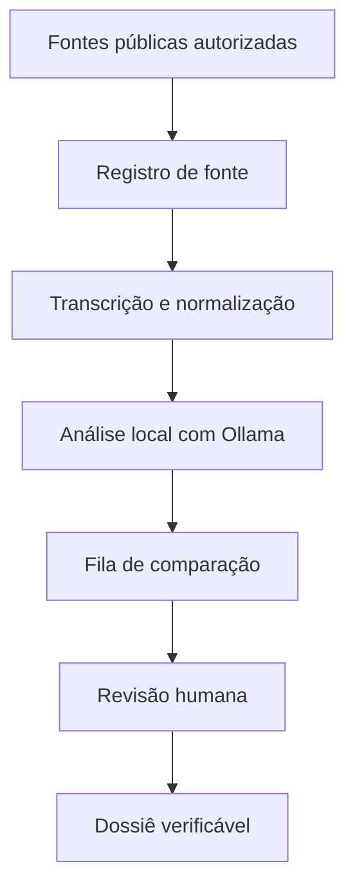

# Arquitetura do MVP

O Observatório Sócrates será um monólito modular local-first. Ele terá banco, credenciais, diretórios e automações próprios; não reutilizará nem alterará o banco, os workflows ou os segredos do NecroPaper.

## Componentes

| Componente | Papel | Limite |
|---|---|---|
| PostgreSQL próprio | registro auditável, versões e decisões | fonte de verdade |
| n8n próprio | agenda, coleta permitida e tarefas manuais | não publica |
| Ollama local | classificação, extração de tópicos e sugestão de pares | não confirma fatos |
| Revisão humana | compara contexto e aprova conclusões | etapa obrigatória |
| Exportador local | gera Markdown/CSV de dossiês aprovados | execução manual |

## Fases do MVP

1. Cadastro manual de fontes e vídeos públicos.
2. Registro de metadados e transcrições de uma amostra pequena.
3. Classificação local assistida por modelo.
4. Comparação humana de casos equivalentes.
5. Dossiê privado, auditável e não-publicado.

Automação de descoberta e transcrição só será desenhada após validação do método com exemplos reais.
