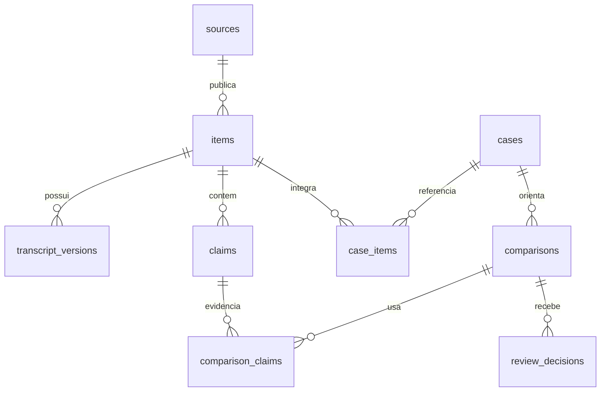

# Schema técnico e regras de persistência

## Separação obrigatória

O Observatório usará banco, usuário e credenciais próprios. A migração abaixo é uma especificação para revisão: ela **não deve** ser aplicada ao PostgreSQL do NecroPaper nem executada antes de aprovação operacional.

## Decisões

- UUID identifica entidades expostas em exports; chaves internas são estáveis.
- URLs canônicas são únicas por item, impedindo duplicação acidental.
- Transcrições são imutáveis por versão; uma correção cria nova linha.
- `analysis_runs` registra saída de modelo como rascunho, separada de decisão humana.
- `review_decisions` é uma trilha de auditoria append-only: uma decisão posterior não apaga a anterior.
- Identificadores de revisores são pseudônimos internos; não há cadastro de dados pessoais desnecessários.

## Entidades e fluxo

## Estados permitidos

`sources.status`: `proposed`, `active`, `paused`, `archived`.

`items.ingestion_status`: `registered`, `transcribed`, `review_ready`, `archived`.

`comparisons.status`: `draft`, `needs_context`, `insufficient_evidence`, `approved_private`, `rejected`.

`review_decisions.decision`: `discard`, `request_context`, `insufficient_evidence`, `approve_private`.

O status de uma comparação pode ser derivado da decisão humana mais recente, mas a tabela de decisões permanece a evidência histórica.

## Privacidade, retenção e acesso

No MVP, guardar somente conteúdo público necessário, metadados de proveniência e identificadores internos de revisão. A política de retenção concreta será definida antes da primeira coleta. A conta de aplicação deve ter somente permissões no banco próprio; credenciais ficam fora de Git e em `.env` local.
